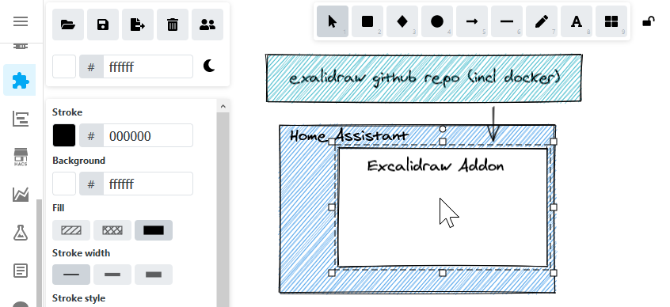

# Home Assistant Excalidraw Add-On

## About

This Home Assistant add-on provides a lokal instance of https://excalidraw.com/ on your own server. See their github repository (https://github.com/excalidraw/excalidraw) for detailed information. 

## Screenshots
Draw your own Home Assistent architecture

### Installation
1. Add the repository to Home Assistant supervisor: Supervisor -> Add-on Store -> "Three dots on the right" -> Repositories
2. Add https://github.com/lein1013/addon-excalidraw as additional add-on repository
3. Install the Excalidraw Addon from the Add-on Store (this could take a while, check the Supervisor logs)

### Contribution
Feel free to fork and improve,... 

[Additional developer notes ](addon_dev.md)

### Credits
All credits got to the Homeassistant and Excalidraw team and community! 
I just did my first steps with this add-on :-)

### Kown Limitations
- In some cases it was observed that excalidraw got stuck at "loading"; there is an open issue https://github.com/excalidraw/excalidraw/issues/2083 - it seems to be related with the service_worker.js load process (cache issue?)

